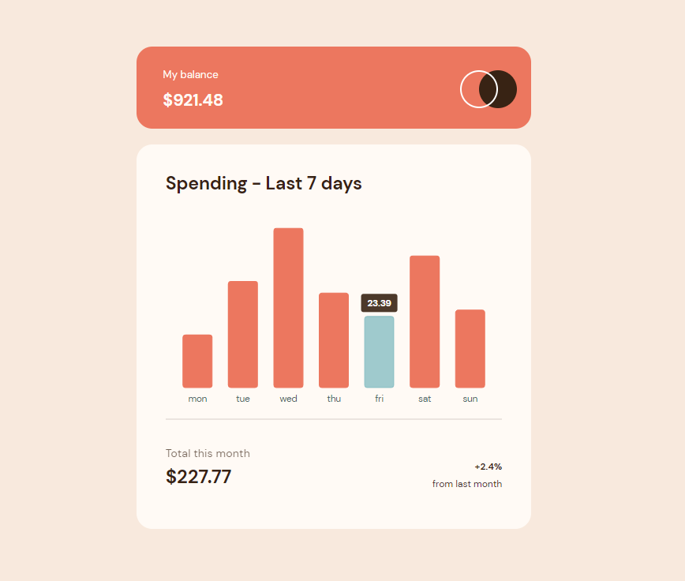

# Frontend Mentor - Expenses chart component solution

This is a solution to the [Expenses chart component challenge on Frontend Mentor](https://www.frontendmentor.io/challenges/expenses-chart-component-e7yJBUdjwt).

## Overview

### The challenge

Users should be able to:

- View the bar chart and hover over the individual bars to see the correct amounts for each day
- See the current day’s bar highlighted in a different colour to the other bars
- View the optimal layout for the content depending on their device’s screen size
- See hover states for all interactive elements on the page
- **Bonus**: Use the JSON data file provided to dynamically size the bars on the chart

### Screenshot

### Links

- Live Site URL: https://alicja1bobko.github.io/Expenses-Chart-Component/

## My process

### Built with

- Semantic HTML5 markup
- CSS custom properties
- Flexbox
- Mobile-first workflow
- React
- [Victory](https://formidable.com/open-source/victory/) - Charts Library
- Tailwind - For styles

### What I learned

This challenge was a way to start practicing Tailwind and learn how to present data on charts. For styling purposes I had to edit themes file provided in documentation to adjust chart to project requirements. 
